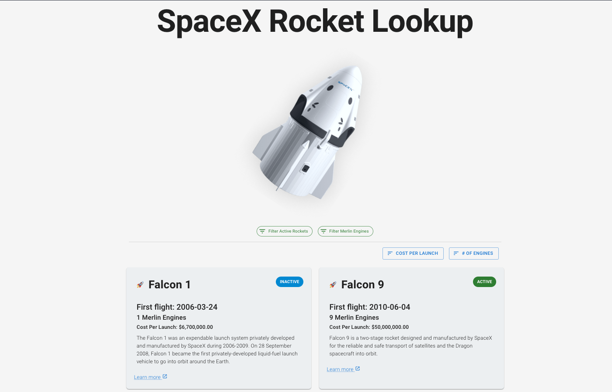

# SpaceX Rocket Tracker



Rocket information using SpaceX's [public GraphQL API](https://studio.apollographql.com/public/SpaceX-pxxbxen/home?variant=current).

- [Future improvements](./docs/TODO.md)

## Setup Guide

> Note: this project was bootstrapped with [Create React App](https://github.com/facebook/create-react-app).

Please ensure you are using the correct Node.js and npm versions.

We have provided a [`.node-version` file](https://github.com/shadowspawn/node-version-usage)
which can be understood by [nvm](https://github.com/nvm-sh/nvm),
[fnm](https://github.com/Schniz/fnm), and [n](https://github.com/tj/n):

```zsh
nvm use || fnm use || n auto
```

To install the project's dependencies:

```zsh
npm install
```

To run the application in development mode locally, run:

```zsh
npm start
```

> Note: open [http://localhost:3000](http://localhost:3000) to view in the browser.

The page will reload if you make edits.
You will also see any lint errors in the console.

## Testing

To run unit tests using [watch mode](https://jestjs.io/blog/2017/02/21/jest-19-immersive-watch-mode-test-platform-improvements) in Jest:

```zsh
npm test
```

To see a code coverage report, you can run:

```zsh
npm run test-coverage
```

> Note: this is an alias for `npm test -- --watchAll=false --coverage`

The coverage report can be opened in the browser:

```zsh
open coverage/lcov-report/index.html
```
